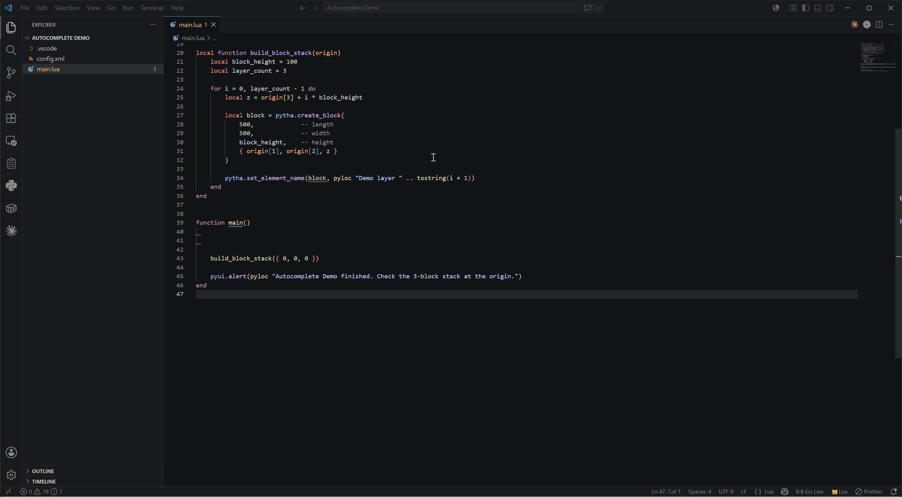

# PYTHA Lua Support

[](https://marketplace.visualstudio.com/items?itemName=pytha-3d-cad.pytha-lua-support)
[](https://marketplace.visualstudio.com/items?itemName=pytha-3d-cad.pytha-lua-support)
[](https://marketplace.visualstudio.com/items?itemName=pytha-3d-cad.pytha-lua-support)
[](LICENSE)

VS Code IntelliSense for the [PYTHA 3D-CAD](https://www.pytha.de) Lua plugin API.



## Features

- **Autocomplete and inline documentation** for the full `pytha`, `pyui`, `pyio`, `pyux`, `pygeo`, `pyplot` namespaces and the `pyloc` function — every entry links straight to the [PYTHA Lua API Wiki](https://github.com/pytha-3d-cad/pytha-lua-api/wiki).
- **Open wiki from the editor**: place the cursor on any `pytha.*` / `pyui.*` / `pyloc` symbol and run **PYTHA: Open wiki for symbol under cursor** (`Ctrl+F1`) or right-click → "PYTHA: Open wiki…". The command palette also exposes **PYTHA: Open API Wiki** as a shortcut to the wiki home.
- **`pyloc` linting**: warns when `pyloc()` is called with a non-literal argument — the translation extractor cannot resolve variables, so a non-literal call silently produces an untranslatable string.
- **Debugging** (attach to PYTHA): breakpoints, conditional breakpoints & logpoints, call stack, variables (locals/upvalues, expandable tables), watch/hover/REPL, stepping, stop-on-error and `print` to the Debug Console. See [Debugging](#debugging) below.
- **`config.xml` schema**: ships an XSD validated against the wiki documentation. Combined with the [Red Hat XML extension](https://marketplace.visualstudio.com/items?itemName=redhat.vscode-xml) you get autocomplete and validation for plugin config files.
- **Code snippets**: scaffolds for dialogs, group boxes, primitive creation, identify calls and persistent storage (prefixes start with `pytha-`).
- **Type checking** via [`sumneko.lua`](https://marketplace.visualstudio.com/items?itemName=sumneko.lua) (declared as a hard dependency). Element handles, control handles, materials etc. are modelled as distinct `---@class` types so wrong handles get flagged.
- **Workspace setup on first activation:**
  - `Lua.runtime.version` is set to `Lua 5.3` (PYTHA's Lua version)
  - `Lua.runtime.builtin.io` is disabled (PYTHA does not expose `io`)
  - the bundled API stub folder is added to `Lua.workspace.library`
  - PYTHA globals (`pytha`, `pyui`, ...) are added to `Lua.diagnostics.globals`
- **Idempotent activation** — settings are only written when they actually differ, so the extension does not churn `settings.json` on every reload.

## Debugging

Debug your Lua plugins directly in VS Code while they run inside PYTHA. The debugger
**attaches** over TCP to a debug server embedded in PYTHA.

**1. Enable it in PYTHA.** In PYTHA's settings, go to the **Developer** page, turn on
**Enable Lua Debugger** and note the **Lua Debugger Port** (default `4711`). The server
starts (or restarts on a port change) immediately — no PYTHA restart needed. It listens on
`localhost` only.

**2. Match the port in VS Code** (only if you changed it from the default):

```jsonc
// settings.json
"pytha-lua.port": 4711,
"pytha-lua.host": "127.0.0.1"
```

**3. Debug.** Open the plugin folder and press **F5** — **PYTHA Lua (attach)** is offered
without any setup. Set breakpoints in the plugin's `.lua` files, then run the plugin in
PYTHA. Execution stops at your breakpoints.

No `launch.json` is required. If you want one anyway (to pin a port per project, or to keep
several configurations side by side), add it via Run → Add Configuration → *PYTHA Lua*:

```json
{
  "version": "0.2.0",
  "configurations": [
    { "type": "pytha-lua", "request": "attach", "name": "PYTHA Lua (attach)" }
  ]
}
```

A `port`/`host` set directly in the launch configuration overrides the settings above.

What works:

- **Breakpoints**, including **conditional breakpoints** and **logpoints** (right-click a
  breakpoint → *Edit Breakpoint…*). A logpoint writes to the Debug Console instead of
  stopping, and substitutes expressions in curly braces: `part {i} of {count}`.
- **Call stack**, and **variables** per frame — locals, upvalues and expandable tables.
  Values can also be **changed in place** while stopped.
- **Watch**, **hover** and the **Debug Console** as a Lua REPL evaluated in the selected frame.
- **Stepping** (over / into / out), continue and pause.
- **Stop-on-error**: an uncaught Lua error breaks at the throw site with the message shown.
- **`print(...)`** is streamed to the Debug Console while debugging (normally disabled in PYTHA).

Notes:

- Only plugins **started while the debugger is attached** are debugged — attach first, then
  run the plugin.
- While stopped at a breakpoint the PYTHA window is frozen (this is expected); it resumes on
  continue/step. Logpoints never stop, so they do not freeze PYTHA.
- Protected (encrypted) plugins cannot be debugged.

A step-by-step guide is also in the wiki:
[Debugging with VS Code](https://github.com/pytha-3d-cad/pytha-lua-api/wiki/Debugging-with-VS-Code).

## Requirements

The extension activates automatically when a `.lua` file is opened. No additional setup is required beyond installing this extension; `sumneko.lua` will be pulled in automatically.

## Known Issues

- API stubs are generated by hand from the wiki and may lag behind the very latest PYTHA release.
- Some functions whose wiki documentation is ambiguous use `any` for parameters — those are marked with a `TODO` comment in `libs/pytha.lua`.

## Contributing

Stubs live in [`libs/pytha.lua`](libs/pytha.lua) and follow the LuaLS `---@meta` convention. To add or fix a function:

1. Find the matching `.md` file in the [API wiki](https://github.com/pytha-3d-cad/pytha-lua-api/wiki).
2. Add or update the function in `libs/pytha.lua` using the existing format (short bold description, wiki link, `@param`/`@return` annotations).
3. Use `---@overload` for alternative signatures rather than duplicate `function` declarations.

## Release Notes

See [CHANGELOG.md](CHANGELOG.md).
